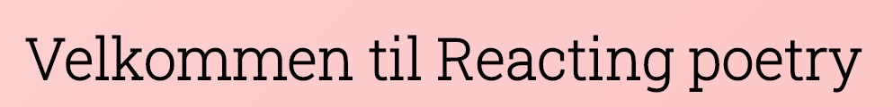

Reactive Poetri viser deg 10 vakre dikt-installasjoner. 
Nydelige dikt hentet fra PoetryDB.org med stemningsfulle melodier til. 
Velg mellom flotte varianter i temaet, som «rosa», «grønn» og «blå». 
Om du føler deg veldig i humør kan du også skru på fancymodus, for å få litt mer kontraster i figurene som gledelig glir over installasjonene. 
Du kan også merke dine favoritter, og filtrere vekk resten, slik at du kan få mest mulig fornøyelse fordelt på så lite areal som mulig.

[](https://gitpod.idi.ntnu.no/#https://gitlab.stud.idi.ntnu.no/it2810-h20/team-58/reacting-poetry) 

# Installasjon

For å installere lokalt via terminalen kan du klone repoet til en valgt mappe med kommandoen:

`git clone https://gitlab.stud.idi.ntnu.no/it2810-h20/team-58/reacting-poetry.git`

Deretter gå inn i mappen med `cd reacting-poetry`, for så å installere node_modules med `npm install`. 
Dette vil ta litt tid.
Når den er ferdig, kan du starte prosjektet med `npm start`.

# Dokumentasjon

## React

Prosjektet er laget med React og Typescript (TS). 
Det har bare blitt brukt funksjonelle komponenter med ES6 syntax, med unntak av Footer-komponenten som er klassekomponent for å oppfylle teknologikrav.

For å endre state har vi benyttet oss av `useState()` - hooken, og den har blitt flittig brukt for å endre states i egen komponent, men og for å sende callback-funksjoner som props til barnekomponenter. 
F.eks i GalleryItem brukes callback funksjon for å endre forelderkomponenten GalleryPage sin favoritePoems-state. 

Hooken `useEffect()` er brukt for å bestemme livssyklusmetoder, og blir blant annet bruk for å gjøre api kall til PoetryDB. 

Context-apiet er brukt til å endre språk på siden. 
Vi fant det veldig nyttig å bruke `Context` for å holde verdien til valgt språk, 
siden alle komponentene som har tekst som vises til bruker trenger å vite hvilket språk den skal vise teksten på, 
og da er det nyttig å slippe å sende props gjennom alle komponenter, 
men at man kan heller importere GlobalLanguageContext i riktig komponent og bruke den direkte. 

For å gi stiler til elementer har vi forsøkt å lage generaliserte klasser som er generelle for alle komponenter. 
F.eks General-container klassen som brukes i mange komponenter for å sette riktig padding på sidene for å sikre konsistens. 
På spesifikke klasser har vi brukt navnekonvensjonen: “KomponentX-prefix-subfix…”. 
På denne måten hindrer vi at ulike komponenter har like prefix og subfix og bruker for mange klasser. 

For å bruke hjerte- og globusikonene har vi lastet ned en liten del av FontAwesome ikonbiblioteket, som ligger lagret under assets/ og mappene /css og /webfonts. 
Dette var anbefalt av studentassistent fra svar på Piazza. 

## SVG

For kunstverkene har vi brukt svg elementene `<rect />`, `<ellipse />` og `<circle />`. 
De har blitt gitt en css klasse med en animasjon for å flyte oppover mens de spinner rundt. 
Videre har svg elementene blitt laget i TS og lagt til tilfeldige variasjoner av elementene. 
De forskjellige variantene av hvert element har fått tilfeldige startkoordinater, animasjonslengde, animasjonsforsinkelse og størrelse. 

Parametriseringen som bruker styrer endrer blant annet farge på svg-elementene og hvor mange svg-figurer som skal vises om gangen. 

## AJAX

Diktene hentes fra PoetryDB.org, som har et åpent REST-api ute som vi bruker. 
Til dette bruker vi `fetch()` som er returnerer et promise. 
Deretter har vi tre `.then()` på rad som sørger for å behandle dataen slik vi vil. 
For å sørge for at siden venter med å vise noe til vi er ferdig har vi en state som heter isLoading,
som vi setter til false etter dataene er ferdig behandlet, og deretter blir dataen i galleriet oppdatert. 

For lyd tok vi opp 10 lydfiler selv, og la de til i prosjektet. 
Vi har brukt HTML5 `<audio>` tagen som man enkelt kan bruke for å legge til lyd i nettsider, 
men vi måtte gjøre noen konfigurasjoner for å få det til å fungere i React, med Typescript. 
Det går ikke å bare linke direkte til lokale lydfiler i et react-prosjekt, så først måtte lydfilene importeres. 
Siden vi bruker Typescript måtte dette gjøres med `require()` istedenfor `import()`. 

Alle lydfilene ble lagt i en liste, og i Poem-interfacet så ligger det en property som heter mp3_index, 
som vi bruker til å sende rett lydfil inn i GalleryItem, slik at samme dikt får samme lydfil hele tiden. 
Lyden begynner å spille i bakgrunn, loopet, når du trykker på et av diktene. 

## HTML Web Storage

Vi har brukt både `Localstorage` og `Sessionstorage` fra HTML Web Storage. 
For å hente og lagre data til Web Storage fulgte vi 
[denne tutorialen](https://dev.to/sanderdebr/building-a-custom-react-localstorage-hook-2bja).
Kode som er hentet herfra er kommentert i koden.

Oversikt over bruk av Web Storage:

**Local Storage**:
- currentLang:
    - Valgt språk er lagret i local storage, siden det er mest sannsynlig at en bruker på samme enhet ikke endrer språk mellom ulike sesjoner.
- colorTheme:
    - Fargetema på diktene i gallerisiden.

**Session Storage**:
- favoritePoems:
    - Favorittdikt som er valgt blir lagret i sessionstorage. Dette kunne også vært gjort i local storage, men det ble mer komplisert å utvikle så derfor er det bare brukt i sessionstorage
- figureAmount: 
    - Antall figurer som vises på hvert dikt-item
- complementaryTheme:
    - Når fancymodus er valgt så viser figurene i en komplementærfarge	

## Responsive Web Design

Siden er laget responsiv ved stor bruk av spesielt `CSS-FlexBox` og `Media Queries`. 
Vi har utviklet med en “Mobile First Approach”, 
som vil si at vi har skrevet stiler for mobilskjerm først, 
også laget Media Queries for Tablet og Desktop størrelser. 

Vi har brukt følgende breakpoints for Media Queries:

```css
@media screen and (orientation: landscape) {}
@media screen and (min-width: 37.5em) {}
@media screen and (min-width: 37.5em) and (orientation: portrait) {}
@media screen and (min-width: 75em) {}
```

GalleryItems har en fast bredde på hvert breakpoint, 
men vi har satt `column-direction: row`, og `flex-wrap: wrap` til at når skjermbredden varierer, 
så flyter items til andre rader parallellt med skjermbredden. 
GalleryPage-actions har og en tilsvarende tilnærming for å vise handlinger fint på små og store skjermer. 

Vi har brukt `em` for CSS størrelser i media query breakpoints, og ellers er det brukt `rem`, `vh` og `vw` som størrelser for å sikre riktig skalering av DOM-elementer.

## Node.js og NPM

Prosjektet er basert på node, og det brukes Node Package Manager for å kjøre å sette opp. 
For å sette opp prosjektet brukte vi [Create React App](https://github.com/facebook/create-react-app).

## Testing

Det er laget 3 snapshottester. 
En av Footer-komponenten, en av Navbar-komponenten, og en av GalleryPage-siden. 
Vi ville også hatt av GalleryItem-komponenten, 
men her er det veldig mange random faktorer som blir opprettet når komponenten opprettes, 
og dette gjorde det vanskelig å lage en snapshottest fra denne. 
I ettertid ser vi at det for testingen sin skyld kunne vært lurere å flyttet de tilfeldige elementene ut av komponenten, 
slik at selve komponenten hadde blitt mer deterministisk ut ifra input-variabler. 

Responsivitet og design er testet mer nøye på tre enheter. 
En MacBook Pro, en Surface Pro (i både nettbrett-modus og laptop-modus) og en Huawei Mate 10 Pro (i landskap og portrettmodus). 
På PC endret vi størrelsen på vinduet i alle slags varianter, fra fullskjerm, til veldig smal og høy, til veldig bred og lav. 
På surface og PC la vi skjermen ned i landskapsmodus og opp igjen til portrettmodus, for å sjekke at alt fungerte som det skulle. 
Alt dette mens vi gikk gjennom de tre hovedsidene til siden: Hjem, Gallery, og med valgt dikt. 

Generelt sett så fungerte alt slik det skulle, og nettsiden oppdaterer seg avhengig av orientering og størrelse på vinduet. 
Gjennom testingen fant vi et par svakheter i det responsive designet som vi fikk fikset opp i, blant annet skalering av linker i navbar. 
Vi fant også en edge-case som vi prioriterte å ikke fikse opp i, ettersom det er omtrent ingen som ville brukt nettsiden på en slik måte at de ville oppdaget det. 
(Dette skjer om du på PC bruker hele bredden, men lar høyden på vinduet bli veldig liten. 
Om du nå går inn på et dikt så kan det være at det ikke får plass). 

## Bruk av Git, koding

Vi har brukt git til versjonskontroll, og GitLab. 
I gitlab har vi laget issues for alt vi skulle gjøre, 
og har valgt å markere alle commits med “RP-#” med RP for Reacting Poetry, 
og # for nummeret på issuen som committen adresserer. 
Vi har også brukt Merge Requests, med fast-forward merging uten merge-commits, 
ettersom vi synes dette gav en mer oversiktlig git-historie.
